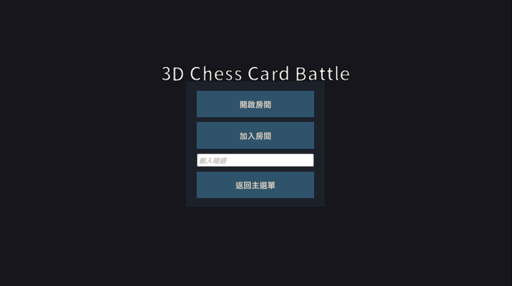
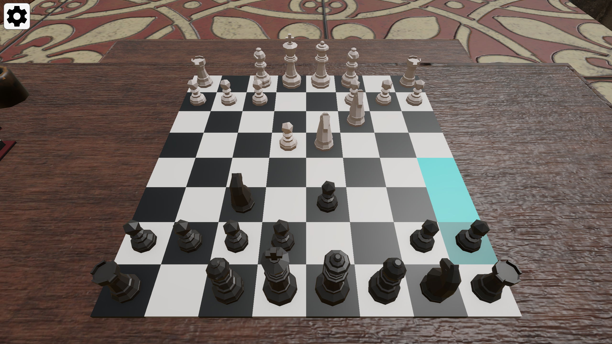
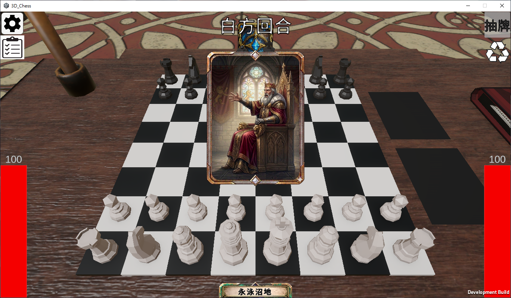
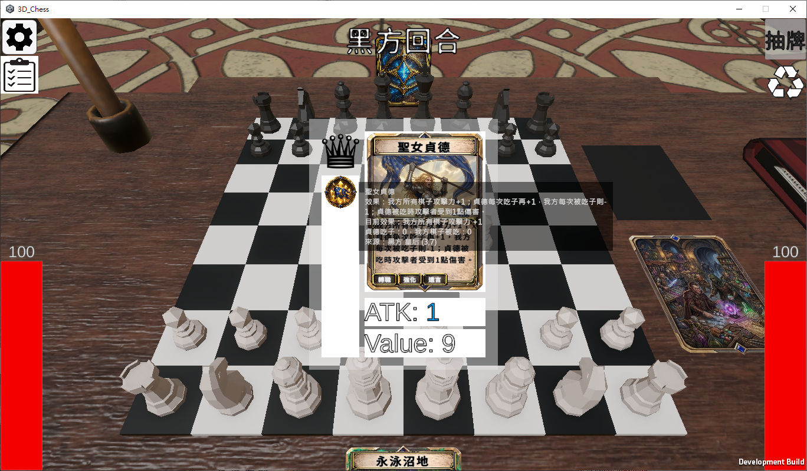

# Chess RPG

Chess RPG 是一款把西洋棋、角色養成與卡牌效果結合在一起的雙人回合制對戰遊戲。玩家仍在標準 8×8 棋盤上移動與吃子，但每枚棋子可以裝備轉職卡，事件卡能立即改變戰局，場地卡則會持續影響棋盤。除了將死之外，玩家也能透過戰鬥與卡牌效果把對手 HP 降到 0 取得勝利。

## Demo 下載

[下載 Chess RPG Windows Demo](https://drive.google.com/file/d/10wfg38B-mL6q0aPW0vJ-NunKaeH3ePWk/view?usp=drive_link)

進入遊戲後可以先編輯牌組，目前可以任意增加減少可抽取到的數量，點擊第三次會出現星號，星號卡片會變成初始手牌。

- 選取開啟房間會進入遊戲場景，並等待對手進入。
- 對手選取加入房間，進入與開房者同一場遊戲。
- 可以設定暗語，暗語相同的玩家會進入同一場遊戲。

## 遊戲規則

### 對戰基礎

- 對戰分為白方與黑方，白方先手。
- 棋盤、初始棋子配置及基本移動規則沿用標準西洋棋。
- 玩家只能在自己的回合操作己方棋子；一次合法移動完成後便進入回合結算。
- 移動不能讓己方國王處於被將軍狀態。
- 兵抵達底線時會進入升變流程，完成升變後才結束回合。
- 王車易位、將軍、將死與無合法步等規則由棋局系統判定。

### HP 與戰鬥

白方與黑方各有 100 HP。棋子吃子及部分卡牌會造成玩家或棋子相關傷害，實際數值會受到攻擊力、棋子價值、狀態、陣營增減傷及傷害類型影響。

一般吃子的核心概念如下：

- 攻擊方的 `ATK` 會加入吃子傷害。
- 被吃棋子的 `Value` 會加入結算；預設兵 1、騎士／主教 3、城堡 5、皇后 9、國王 0。
- 技能與事件通常使用各自的基礎傷害，不自動加入 `ATK` 或 `Value`。
- 傷害可帶有物理、火焰、電擊、毒、詛咒、技能、事件等標籤，供卡牌效果判斷。

傷害修正依序為「輸出方加成／倍率 → 目標承傷修正 → 陣營與玩家減傷 → 輸出方最終指定值」。HP 代價屬於直接支付，不套用一般增傷與減傷。

### 卡牌系統

雙方各自擁有一份相同且獨立洗牌的 36 張牌庫：

| 類型 | 數量 | 使用方式 | 效果 |
|---|---:|---|---|
| 轉職卡 `J01–J12` | 12 | 拖到符合棋種的己方棋子 | 改變能力、狀態、攻防或走法；新卡會取代該棋子原有轉職卡 |
| 事件卡 `E01–E12` | 12 | 拖到合法棋子或指定目標 | 成功後立即結算，不會取代棋子的轉職卡 |
| 場地卡 `F01–F12` | 12 | 拖到場地區 | 建立持續性棋盤規則，部分場地可融合、封鎖路徑或在破壞時觸發效果 |

開局每方抽 1 張牌。每回合開始時可抽 1 張；一旦移動棋子，本回合便不能再抽牌，因此通常要先決定是否抽牌。玩家也可以把手牌拖到回收區，移除該牌並重新取得本回合的抽牌機會。牌庫耗盡時不再抽牌。

卡牌只有在目標、陣營、棋種及特殊條件全部合法時才會消耗。卡牌造成的狀態可能是永久、限時、移動後移除或充能制；相同事件狀態再次套用時通常刷新而非重複疊加。

### 勝負條件

符合任一條件時對局結束：

- 對手 HP 降至 0：勝利。
- 對手國王被將死：勝利。
- 當前玩家沒有合法步但未被將軍：和局。
- 棋盤只剩兩個國王：和局。
- 特定卡牌直接觸發勝負結果。

## 一回合的流程

1. **回合開始**：顯示階段提示，結算當前陣營的回合開始狀態與卡牌效果。
2. **操作階段**：玩家可抽牌、回收牌、使用任意張合法卡牌，並選擇一枚己方棋子移動。
3. **移動與吃子**：系統驗證走法、將軍限制及場地限制，然後處理吃子、傷害、技能與動畫。
4. **特殊流程**：若兵抵達底線，先完成升變；所有傷害序列結算完成前會鎖定其他操作。
5. **回合結束**：處理回合結束效果、狀態時間與場地效果。
6. **勝負檢查**：檢查 HP、將死、無合法步與子力不足，再把控制權交給另一方。

## 完整遊戲流程

1. 從 `StartScene` 選擇本機對戰或連線模式。
2. 連線模式由一方建立房間，另一方加入；主機載入 `ChessScene` 並同步對局。
3. `Board` 建立棋盤與標準初始棋子，`LogicManager` 初始化回合、HP、卡牌及場地狀態。
4. 雙方依照回合流程交替行動，直到觸發勝負條件。
5. `GameOverUI` 顯示結果；玩家可重新開始或返回開始畫面。

## 專案架構

專案使用 Unity `6000.2.6f2`，主要遊戲碼集中在 `Assets/Scripts`。遊戲資料目前不是獨立 `ScriptableObject` 資產，而是由一般 C# 資料類別與 Inspector 資源共同組成。

### 場景

| 場景 | 職責 |
|---|---|
| `Assets/Scenes/StartScene.unity` | 模式選擇、建立／加入連線與進入遊戲 |
| `Assets/Scenes/ChessScene.unity` | 棋盤、棋子、回合、卡牌、UI 與連線對局 |

### 核心模組

| 檔案／模組 | 主要職責 |
|---|---|
| `Board.cs` | 生成 8×8 棋盤與初始棋子 |
| `Piece.cs` 與各棋種類別 | 棋子狀態、移動、吃子、合法步與轉職後走法 |
| `LogicManager.cs` | 對局總協調、回合狀態、HP、將軍／勝負判定、傷害佇列與場地效果 |
| `ChessCard.cs` | 卡牌資料模型、圖片／音效引用與 36 張卡牌的建立牌庫入口 |
| `CardSkill.cs` | 卡牌狀態、觸發時機、數值修正、特殊技能與事件結算 |
| `CardBattleSystem.cs` | 把移動、吃子、回合事件轉交卡牌技能系統 |
| `CardHandManager.cs` | 雙方牌庫與手牌、抽牌、回收、出牌、UI 及連線卡牌狀態 |
| `CardDragHandler.cs` | 將卡牌拖放到棋子、場地區或回收區 |
| `MultiplayerGameController.cs` | 主機權威的指令驗證與棋局、HP、卡牌狀態同步 |
| `NetworkSessionLauncher.cs` | Photon PUN 房間建立、加入與場景啟動 |
| `GameFlowUI`、`GameOverUI`、`OperateLogUI` | 階段提示、結果畫面與操作紀錄 |

### 執行資料流

```text
玩家輸入 / 網路指令
        ↓
InputManager / CardDragHandler / MultiplayerGameController
        ↓
LogicManager ───── CardHandManager
    ↓                    ↓
Board + Piece       ChessCard + CardSkill
    └──────── CardBattleSystem ────────┘
                    ↓
       傷害、狀態、動畫、UI、勝負判定
```

`LogicManager` 是目前的對局協調中心；棋子負責走法，卡牌資料由 `ChessCard` 建立，效果集中在共享的 `CardSkill.Shared`。連線對局以主機為權威：客戶端提交操作，主機驗證並套用，再把棋局與卡牌狀態同步給其他玩家。

### 卡牌資料與效果分工

- `ChessCard.BuildCards()` 是完整卡池；要讓新卡能被抽到，必須加入此清單。
- `BuildJXX()`、`BuildEXX()`、`BuildFXX()` 只建立卡號、名稱、類型、目標、說明及 Inspector 資源。
- `CardSkill.ConfigureCard()` 根據卡號掛上狀態、效果、特殊走法、傷害標籤與動畫。
- 事件卡由 `CardSkill.ResolveEvent()` 立即結算。
- 棋子裝備卡會經過 `Piece.ApplyCard()`；同一棋子只保留一張轉職卡。
- 通用效果使用 `StatusDefinition` 與 `CardEffectData`；無法資料化的規則才寫入 `CardSkill` 對應事件函數。

`CardSkill` 是單一 `sealed class`，所有卡片共用 `CardSkill.Shared`。新增卡牌時不要為每張卡建立 subclass 或 override。

## 新增卡牌

1. 在 `ChessCard` 宣告卡面、狀態圖、特效 Prefab 或音效的 Inspector 欄位。
2. 在 `ChessScene` 的 `CardGameUI/ChessCard` 元件掛上資源。
3. 新增 `BuildJXX()`、`BuildEXX()` 或 `BuildFXX()`，並給予唯一卡號。
4. 在 `CardSkill.ConfigureCard()` 加入卡號與對應的 `ConfigureJXX/EXX/FXX()`。
5. 優先以 `StatusDefinition.effects` 描述數值與觸發效果；特殊條件再加入既有的 `CanApply`、`OnEquip`、`OnOwnerCaptured` 等函數。
6. 將建構函數加入 `ChessCard.BuildCards()`。
7. 進入 Play Mode，驗證目標限制、狀態生命週期、傷害、動畫、連線同步及 Console 錯誤。

## 開發與執行

1. 使用 Unity `6000.2.6f2` 開啟專案。
2. 確認 `StartScene` 與 `ChessScene` 都存在於 Build Settings。
3. 從 `StartScene` 進入本機或連線模式。
4. 卡牌資源若顯示空白，檢查 `ChessScene > CardGameUI > ChessCard` 的 Inspector 引用。

連線設定與測試細節請參考 `Assets/Scripts/Networking/MULTIPLAYER_README.md`。

## 畫面預覽

<p float="left">
  
  
  
  
</p>
